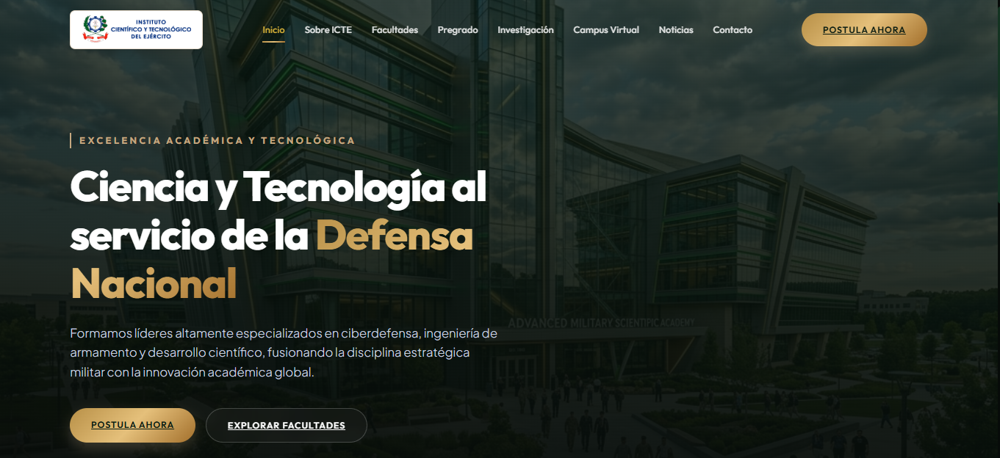
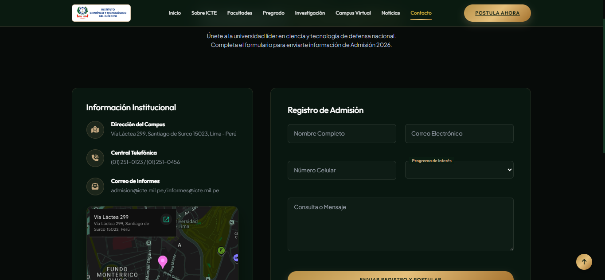

# ICTE Web Redesign

## 📖 Descripción

ICTE Web Redesign es una propuesta de rediseño del sitio web del Instituto Científico del Ejército (ICTE), desarrollada con el objetivo de ofrecer una interfaz moderna, intuitiva y responsiva, mejorando la experiencia del usuario y la presentación de la información institucional.

## 🚀 Características

- Diseño moderno y profesional.
- Interfaz totalmente responsiva.
- Navegación intuitiva.
- Animaciones e interacciones dinámicas.
- Optimización para SEO y accesibilidad.
- Galería de imágenes con Lightbox.
- Contadores animados.

## 🛠️ Tecnologías utilizadas

- HTML5
- CSS3
- JavaScript (ES6+)
- Bootstrap 5.3
- Google Fonts
- Font Awesome

## 📂 Estructura del proyecto

```text
ICTE-Web-Redesign/
├── index.html
├── style.css
├── script.js
├── assets/
│   ├── images/
│   ├── icons/
│   └── fonts/
└── README.md
```

## ▶️ Cómo ejecutar el proyecto

1. Clona el repositorio:

```bash
git clone https://github.com/arrietaramirezjarol9-ui/Icte-Web-Redesign.git
```

2. Abre la carpeta del proyecto.

3. Ejecuta el archivo `index.html` en tu navegador.

# ICTE Web Redesign

## 🏠 Inicio



---

## 📞 Contacto



---

## 🖥️ Vista general


## 👨‍💻 Autor

**Jermain Arrieta Ramírez**

Estudiante de Ingeniería de Sistemas.

## 📄 Licencia

Este proyecto fue desarrollado con fines académicos y como parte de mi portafolio de desarrollo web.
